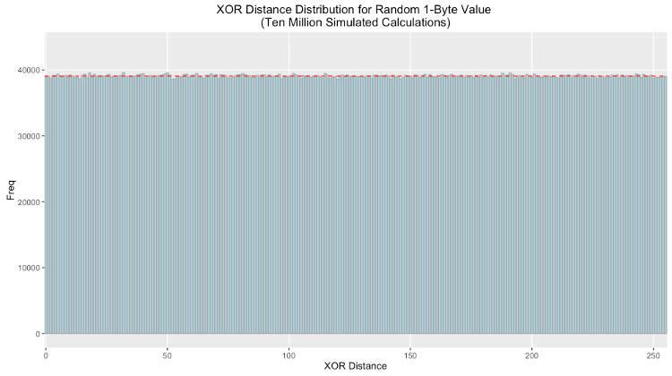

# KFS: *a LevelDB sharding algorithm based on the XOR metric*

> Written by Lily Anne Hall with contributions from Patrick Gerbes.

The KFS system describes a method for managing the storage layer of nodes on 
the [Storj Network](https://storj.io) by creating a sharded local database 
where content-addressable data is placed in a shard using the same routing 
metric and algorithm used by the Kademlia distributed hash table.

## background

The Storj network consists of a number of distributed peers who provide 
storage capacity for lease to others. In its current implementation, these 
nodes store encrypted shards and their associated metadata in a [LevelDB]. 
LevelDB provides a number of features that make it desirable for this use 
case; this includes its lexicographically sorted keys providing fast lookups 
for content-addressable values, fast and efficient compression, and perhaps 
most notably its portability which allows the Storj software to run on a 
wide range of hardware including dated or underpowered computers.

However, due to the nature of LevelDB's design and its implementation in 
the Storj software, its performance suffers after the size of the database 
exceeds approximately 100GiB. This impact is larger on lower end systems and 
can also vary based on the type of disk in use. These performance issues seem 
to arise from LevelDB's compaction mechanism (which is an otherwise desirable 
feature). In addition to the cost of compaction, LevelDB blocks reads and 
writes during this process, which causes storage nodes to become effectively 
offline until the process completes. 

These properties indicate that if the size of a single database can be given an 
upper bound, then the cost of compaction can be significantly reduced to an 
acceptable level. Futhermore, in using a single database, if one level becomes 
corrupted, deleted, or otherwise inaccessible, the entire database may become 
unusable and unrecoverable. For these reasons, the KFS system seeks to create 
a series of size-capped databases where data is stored in a given "shard" 
based on a deterministic metric to ensure a sufficiently random and even 
spread to bound the cost of compaction, to reduce the impact of corruption, and 
to completely eliminate the need to maintain an index or state machine to
efficiently lookup stored data.

## design

### S-Buckets and Routing

KFS requires that there be a reference identifier, which can be any arbitrary 
`R` bit key. This can be randomly generated upon creation of the database or 
derived from some other application or protocol specific information. In the 
Storj network, nodes are addressed with a 160 bit node identifier derived from 
the public portion of an ECDSA key pair. This *Reference ID* is used to 
calculate the database shard or *S-Bucket* to which a given piece of data 
belongs. Collectively, these S-Buckets form the *B-Table*.

In KFS, there are a total of `B` S-Buckets, numbered `0`-`B-1`. To determine 
which bucket a piece of raw binary data belongs in, calculate the [distance] 
between the first byte of the hash of the data and the first byte of the 
reference ID. This is to say that if the distance between those bytes is 137, 
then the raw binary data should be stored in S-Bucket 137. An S-Bucket has a 
fixed size, `S`, in bytes. This means that a KFS database has a maximum size of 
`B * S` bytes. Once an S-Bucket is full, no more data can be placed in it. Once 
a KFS database is full, another should be created using a new Reference ID. 
Given the default constants, KFS databases are capped at a maximum of 8TiB each.

### Keying Data by Chunks

To optimize the efficiency of reads and writes in KFS, data is stored in `C` 
sized chunks (or less), keyed by the full content's hash, followed by a 
space and a numerical index. This is performed to ensure that key/value pairs 
are small and that reading and writing data to and from a S-Bucket is done 
sequentially and can allow for efficient streaming of data both in and out of 
the S-bucket.

Since LevelDB sorts items lexicographically, keys for data chunks should be 
strings and consist of:

```
Hexidecimal(Hash) + ' ' + 00000N
```

The number of preceding zeroes in the numerical index should be set such that 
a S-Bucket that contains only a single file split into `C` sized chunks  can 
still be read sequentially from the database. Using the default constants 
would make the highest number index 262144, so the number of leading zeroes 
should be less than or equal to five.

### Ad-Hoc S-Bucket Initialization

Given the low cost of creating and opening a LevelDB, it is not necessary to 
create all `B` S-Buckets at once. Instead, an S-Bucket can be created the first 
time data is to be stored inside of it. Additionally, S-Buckets can be opened 
and closed as needed, eliminating the potential overhead of opening a large 
number of file descriptors. Operations on a given S-Bucket should be added to 
a queue which when drained may trigger a close of the S-Bucket's underlying 
database.

Kademlia's metric for determining distance is defined as the result of 
the XOR operation on a set of bits interpreted as an integer. As such, for 
two randomly generated sets of bits, the result is uniformly distributed. Therefore
the XOR distance between pseudo-random first bytes of the reference ID and hash 
give any bucket an equal chance of being selected. 

Below is the frequency distribution plotted with ten million simulated calculations.
As expected the distribution is uniform (the red dotted line indicates the theoretical
value each bin should have): 



Even with a uniform distribution, as the node reaches capacity some buckets will fill sooner than others. 
Offers that would be sorted into these buckets should be declined and relayed to other nodes.

## constants

| Name | Description                        | Default               |
|------|------------------------------------|-----------------------|
| B    | Number of columns in the B-table   | 256                   |
| S    | Size (in bytes) of an S-Bucket     | 34359738368 (32GiB)   |
| C    | Size (in bytes) of a file chunk    | 131072                |
| R    | Number of bits in the Reference ID | 160                   |

## considerations specific to storj

* Storj farmers receive contracts for data shards that are already close to 
  their own Node ID. To improve S-Bucket distribution, it may be desirable to 
  double hash the data or otherwise force a degree of randomness before 
  selecting a S-Bucket for storage.
* The use of KFS in the Storj network creates an upper limit to how much data 
  can be stored by a given Node ID (or identity). This encourages farmers to 
  operate multiple nodes with different identities which lends itself to better 
  network integration.
* The use of HD (hierachical deterministic) private keys could allow a single 
  farmer identity to assume multiple Reference IDs, thus eliminating the limit.
* KFS does not track or store metadata about the contents of a S-Bucket, which 
  in the context of the Storj network would include contracts and other special 
  information related to a piece of data. Applications should handle this via 
  their own means.

## performannce testing

One major hypothesis of this project is that KFS enhances performance over 
the use a of a standard LevelDB instance. This is due to the nature of how 
KFS bounds the cost of LevelDB's compaction mechanism by sharding a data set 
over a series of size-capped LevelDB instances. A set of performance tests 
were run on a standard LevelDB along with our version which leverages KFS. 
This is a short summary of our findings and their implications. 

### Experiment Design 

A series of one hundred trials were run in sequential order. 
Each trial consisted of measuring the execution time for a complete read, 
write, and unlink (delete) operation on file sizes of 8, 16, 32, 64, 128, 256 
and 512 MiB. Keeping in mind that files are split into discrete 128KiB key/value 
pairs, keyed by a hash of the content of the entire file, this means that the 
actual number of read/write/delete operations are equal to the size of the file
divided by 128KiB.

Of particular note is that each sequential test run adds approximately 1GiB to 
the full size of the database (since unlinks only tombstone entries). Our 
number of trials is consistent with our assertion that LevelDBs performance 
degrades significantly after the size of the database exceeds 100GiB.

This experiment was conducted for both a vanilla (standard) LevelDB and a 
version using the KFS protocol. In addition we ran the experiment using 
a hard disk drive (HDD) and solid state drive (SSD). 

### Results 

An overview plot displaying the execution time by file size and operation for 
each trial indicates some difference between KFS and a vanilla LevelDB. At a 
high level it appears vanilla LevelDB had a higher variance across many 
categories. It is our belief that this variance is due to compaction triggering 
in LevelDB as the size of the single instance grows quickly.

Since data is spread in a uniform fashion across a series of LevelDBs in KFS, 
this compaction triggering happens less frequently and has a much smaller 
impact.


Upon closer inspection the data shows that in every category the mean execution
time is lower for KFS for all categories. As for variance, the story is a bit more 
complicated. On SSD vanilla LevelDB has much greater variance than KFS for writes and 
unlinks but more consistent for reads. On HDD both KFS and vanilla show greater 
variance, but again KFS performs more consistently on writes and unlinks. 

Mean execution time comparison for SSD and HDD. 


Standard deviation execution time comparison for SSD and HDD. 


We ran two sided 
[significant tests](http://www.stat.yale.edu/Courses/1997-98/101/sigtest.htm) 
on each combination of operation and file size with a p-value cut-off at .05.
For reads at 8, 16, 32, 64, 128 and 256 MiB file sizes, along with unlinks at 64 MiB we are 
unable to reject the null hypothesis. Or in other words, we are unable to suggest KFS 
performs better than a vanilla LevelDb in those scenarios. For the rest, we did achieve 
a 95% confidence level. This suggests that our measurements are not the 
result of a statistical fluke and KFS introduces meaningful change for those operations 
and file sizes. Please note that any confidence level of 100% is an artifact of rounding. 
In this scenario a p-value of 0 is theoretically impossible.


### Conclusion 

While P-Values should not be followed blindly, the data does indicate that 
the KFS protocol gives statistically significant gains in speed and consistency.

To reproduce the data generated for these tests:

* Clone this git repository
* Make sure you have Node.js and NPM installed
* Run `npm install` from the project root directory
* Run `npm run benchmark [iterations] [path_to_write_results]`

You can set the path to the database to create using the `KFS_PERF_DIR` 
environment variable for testing on different types of drives. If no path to 
write results to is specified, they will be written to stdout.

If you want to experiment with chunk size (discrete key/value pairs associated 
with a file), modify the `C` constant in `lib/constants.js`.

## javascript implementation

KFS is based on LevelDB, an embedded key-value store, but the 
interface for interacting with a KFS is focused on the storage and retrieval 
of files and arbitrary binary streams.

### Getting Started

To create and open a new KFS database (or open an existing one), simply 
require the module and create a {@link Btable} object:

```
const kfs = require('kfs');
const myDataStore = kfs('/path/to/database.kfs');
```

### Check if a File Exists

To check if a file exists at a given key, use the {@link Btable#exists} method:

```
const some160bitKey = 'adc83b19e793491b1c6ea0fd8b46cd9f32e592fc';

myDataStore.exists(some160bitKey, (err, exists) => {
  console.log('The file ' + (exists ? 'DOES' : 'DOES NOT') + ' exist!');
});
```

### Check if a File Can Be Stored

To check the available space for a file at a given key, use the 
{@link Btable#getSpaceAvailableForKey} method:

```
const fileSizeInBytes = 4096;

myDataStore.stat(some160bitKey, (err, result) => {
  if (err) {
    // handle error
  }

  let enoughFreeSpace = result.sBucketStats.free > fileSizeInBytes;

  console.log('There ' + (enoughFreeSpace ? 'IS': 'IS NOT') + ' enough space!');
});
```

### Write a File to the Data Store

To write a raw buffer to the data store, use the {@link Btable#writeFile} 
method:

```
const myFileBuffer = Buffer.from([/* ... */]);

myDataStore.writeFile(some160bitKey, myFileBuffer, (err) => {
  console.log('File ' + (err ? 'WAS NOT' : 'WAS') + ' written!');
});
```

### Read a File from the Data Store

To read a file into memory from the data store, use the {@link Btable#readFile} 
method:

```
myDataStore.readFile(some160bitKey, (err, fileBuffer) => {
  console.log(err || fileBuffer);
});
```

### Remove a File from the Data Store

To remove a file from the data store, use the {@link Btable#unlink} method:

```
myDataStore.unlink(some160bitKey, (err) => {
  console.log('The file ' + (err ? 'WAS NOT' : 'WAS') + ' removed!');
});
```

### Use the Streaming Interfaces

When reading or writing larger files, you may not wish to buffer everything 
into memory. In these cases, use the {@link Btable#createReadStream} and 
{@link Btable#createWriteStream} methods:

```
myDataStore.createReadStream(some160bitKey, (err, readableStream) => {
  if (err) {
    // handle error
  }

  readableStream.on('data', (chunk) => {
    console.log('Got chunk:', chunk);
  });

  readableStream.on('end', () => {
    console.log('All chunks read!');
  });

  readableStream.on('error', (err) => {
    console.log('Failed to read file:', err.message);
  });
});
```

```
myDataStore.createWriteStream(some160bitKey, (err, writableStream) => {
  if (err) {
    // handle error
  }

  writableStream.on('finish', () => {
    console.log('All chunks written!');
  });

  writableStream.on('error', (err) => {
    console.log('Failed to write file:', err.message);
  });

  writableStream.write(Buffer.from([/* ... */]));
  writableStream.write(Buffer.from([/* ... */]));
  writableStream.write(Buffer.from([/* ... */]));
  writableStream.end();
});
```

## command line interface

KFS comes bundled with a handy command line interface for dealing with your 
databases. You can access this tool by installing the package globally:

```
npm install -g kfs
```

Once the installation completes, you can use the `kfs` command. To see usage 
information, run:

```
Usage: kfs [options] [command]


  Commands:

    write <file_key> [file_path]                 write the file to the database (or read from stdin)
    read <file_key> [file_path]                  read the file from the database (or write to stdout)
    unlink <file_key>                            unlink (delete) the file from the database
    list [options] <bucket_index_or_file_index>  list all of the file keys in the given bucket
    stat [options] [bucket_index_or_file_key]    get the free and used space for the database 
    compact                                      trigger a compaction of all database buckets
    *                                            print usage information to the console

  Options:

    -h, --help          output usage information
    -V, --version       output the version number
    -d, --db <db_path>  path the kfs database to use (default: /home/bookchin/.kfs/default)
```

### Writing a File To KFS

There are two ways to write a file to a KFS database:

1. Supplying an optional path to an existing file
2. Reading from STDIN

To write a file that exists on the file system already, just supply it's path:

```
kfs write somefilekey /path/to/my/file.bin
```

To have the CLI read from STDIN, just pipe the output of another program to it:

```
cat /path/to/my/file.bin | kfs write somefilekey
```

If an error is encountered, the process will terminate and write the error 
message to STDERR.

### Reading a File From KFS

There are two ways to read a file from a KFS database:

1. Supplying a path to write the output
2. Writing to STDOUT

To read from a KFS and write it to a file, just supply a path:

```
kfs read somefilekey /path/to/write/file.webm
```

To have the CLI write to STDOUT, just pipe the output to another program:

```
kfs read somefilekey | mplayer -
```

If an error is encountered, the process will terminate and write the error 
message to STDERR.

### Unlinking a File From KFS

To unlink (or mark for deletion), simply provide the file key:

```
kfs unlink somefilekey
```

If an error is encountered, the process will terminate and write the error 
message to STDERR.

### Getting Stats for a KFS

You can see the amount of space available for a given file key:

```
kfs stat somefilekey
246.s    34359738368 
```

This writes the S-bucket index and the number of bytes available to STDOUT. 
You can also view this in a human readable form with the `-h` option:

```
kfs stat somefilekey -h
246.s    32.0 GiB
```
## License

> KFS - A Local File Storage System Inspired by Kademlia  
> Copyright (C) 2016 Storj Labs, Inc

This program is free software: you can redistribute it and/or modify
it under the terms of the GNU General Public License as published by
the Free Software Foundation, either version 3 of the License, or
(at your option) any later version.

This program is distributed in the hope that it will be useful,
but WITHOUT ANY WARRANTY; without even the implied warranty of
MERCHANTABILITY or FITNESS FOR A PARTICULAR PURPOSE.  See the
GNU General Public License for more details.

You should have received a copy of the GNU General Public License
along with this program.  If not, see [http://www.gnu.org/licenses/].
