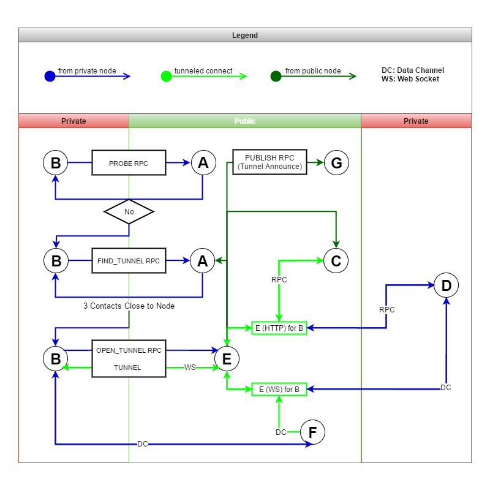

# Storj Core *protocol specification version 2*

> Authored by Lily Anne Hall with contributions from Braydon Fuller

## remote procedure calls

Nodes communicate with each other using
[JSON-RPC 2.0](http://www.jsonrpc.org/specification) over HTTPS. This requires
farmers (nodes who are contracted by renter to store data) to be publicly
addressable and enables access to content from web browsers, mobile phones, and
any other devices that speak HTTP (hint: everything).

This document outlines the specification for the RPC interface by defining the
message structure, required methods, and expected response formats that are
needed for a Storj protocol compliant implementation.

> Note that there may be other aspects of the protocol that are implemented as
> SIPs (Storj Improvement Proposals). See the end of this document for a list
> of implemented SIPs.

### Request Format

Requests are formed according to the JSON-RPC 2.0 specification and are issued
via HTTP POST. The Storj protocol requires the use of *named parameters* -
positional parameters are not supported. Example:

```
{
  "method": "PING",
  "params": {
    "contact": {
      "address": "10.0.0.2",
      "port": 1337,
      "nodeID": "89cc3ddb4209c6e7e301c10c0257adf4fd85f253",
      "protocol": "0.8.1"
    },
    "nonce": 1455216323786,
    "signature": "3045022100de2e162d017a1e9d0ebfe2a94df3fc847b68281a9882..."
  },
  "id": "7b6a2ab35da6826995abf3310a4875097df88cdb"
}
```

The receiving node for this request would then respond with the result, which
in the case of a `PING` message, is simply an acknowledgement that includes
the recipient's contact information and required `signature` and `nonce`:

```
{
  "result": {
    "contact": {
      "address": "10.0.0.3",
      "port": 1337,
      "nodeID": "48dc026fa01ae26822bfb23f98e725444d6775b0",
      "protocol": "0.8.1"
    },
    "nonce": 1455216323786,
    "signature": "304502207e8a439f2cb33055e0b2e2d90e775f29d90b3ad85aec0c..."
  },
  "id": "7b6a2ab35da6826995abf3310a4875097df88cdb"
}
```

In the event that an error occurs, an `error` property must be *added* to the
response. You *still* need to include your `contact` data in the `result`
property of the response:

```
{
  "result": {
    "contact": {
      "address": "10.0.0.3",
      "port": 1337,
      "nodeID": "48dc026fa01ae26822bfb23f98e725444d6775b0",
      "protocol": "0.8.1"
    },
    "nonce": 1455216323786,
    "signature": "304502207e8a439f2cb33055e0b2e2d90e775f29d90b3ad85aec0c..."
  },
  "error": {
    "code": -32603,
    "message": "OH GOD THERE'S SO MUCH BLOOD"
  },
  "id": "7b6a2ab35da6826995abf3310a4875097df88cdb"
}
```

### Joining the Network

To join the Storj network, one must only know the contact information for a
single "seed" node. A node's contact information is defined as the following
three properties:

* `address` - hostname, domain, or IP
* `port` - port number on which the node is listening
* `nodeID` - hash of the node's public key (see below)
* `protocol` - version of the protocol implementation

This information can be expressed as a URI in the following format:

```
storj://10.0.0.2:1337/89cc3ddb4209c6e7e301c10c0257adf4fd85f253
```

In addition to knowing this information about the seed, you also will need to
know this information about yourself, so that it can be provided to the nodes
with which you are communicating. Your "contact card" must be provided as the
`contact` parameter in every message sent (both requests and responses). This
is because messages must be signed with your private key and your `nodeID` is
used by recipients to verify two things:

1. That you own the private key corresponding to your claimed `nodeID`
2. That the message was in fact sent by you and not an attacker

In the Storj network, nodes are identified by the hash of the public portion of
an ECDSA key pair. Key pairs are generated using curve SECP256K1 and a node's
`nodeID` is the "pubkeyhash", defined as:

```
RIPEMD160(SHA256(public_key))
```

This pubkeyhash, combined with a message and signature is enough data to
reconstruct the complete public key and is used in the Storj network to sign
and verify messages. This ensures that nodes are unable to assume the identity
of another node by claiming it has the same `nodeID`.

#### Special Headers

##### `x-storj-node-id`

Every request sent should include this header. It's value should equal the 
expected Node ID of the destination. This allows nodes who are tunneling 
other nodes to determine who the message is intended for.

#### PROBE

Before a node can join the network, it must determine whether or not it is
reachable (or *publicly addressable*). This can be determined by sending a
`PROBE` request to a known seed.

```
{
  "method": "PROBE",
  "params": {
    "contact": {
      "address": "10.0.0.3",
      "port": 1337,
      "nodeID": "48dc026fa01ae26822bfb23f98e725444d6775b0",
      "protocol": "0.6.0"
    },
    "nonce": 1455216323786,
    "signature": "304502207e8a439f2cb33055e0b2e2d90e775f29d90b3ad85aec0c..."
  },
  "id": "7b6a2ab35da6826995abf3310a4875097df88cdb"
}
```

The `PROBE` RPC message triggers the recipient to attempt to reach the
supplied {@link Contact} directly by sending a `PING` RPC message. If the
target {@link Contact} reponds to the `PING`, then the `PROBE` should yield
a success response, which is indicated by simply responding to the RPC
message with only the required parameters and **no** `error` property.

```
{
  "result": {
    "contact": {
      "address": "10.0.0.3",
      "port": 1337,
      "nodeID": "48dc026fa01ae26822bfb23f98e725444d6775b0",
      "protocol": "0.6.0"
    },
    "nonce": 1455216323786,
    "signature": "304502207e8a439f2cb33055e0b2e2d90e775f29d90b3ad85aec0c..."
  },
  "id": "7b6a2ab35da6826995abf3310a4875097df88cdb"
}
```

If the `PING` message triggered by the `PROBE` fails, then the recipient of the
`PROBE` RPC must respond with an error indicating to the sender that she is not
addressable.

```
{
  "result": {
    "contact": {
      "address": "10.0.0.3",
      "port": 1337,
      "nodeID": "48dc026fa01ae26822bfb23f98e725444d6775b0",
      "protocol": "0.6.0"
    },
    "nonce": 1455216323786,
    "signature": "304502207e8a439f2cb33055e0b2e2d90e775f29d90b3ad85aec0c..."
  },
  "error": {
    "code": -32603,
    "message": "PROBE FAILED"
  },
  "id": "7b6a2ab35da6826995abf3310a4875097df88cdb"
}
```

If the `PROBE` fails, you cannot successfully join the overlay and need to
establish a **tunnel** through a node that *is* addressable on the network.

#### FIND_TUNNEL

Finding a node that is willing to tunnel your connection to the overlay begins
with a `FIND_TUNNEL` RPC message sent to a known seed. Nodes on the network
maintain a record of known nodes that are willing to tunnel, by subscribing to
"tunnel announcements" over the publish/subscribe system.

> For more information on how nodes announce willingness to tunnel, see the
> documentation for {@tutorial tunnel-connections}.

```
{
  "method": "FIND_TUNNEL",
  "params": {
    "relayers": [],
    "contact": {
      "address": "10.0.0.3",
      "port": 1337,
      "nodeID": "48dc026fa01ae26822bfb23f98e725444d6775b0",
      "protocol": "0.8.1"
    },
    "nonce": 1455216323786,
    "signature": "304502207e8a439f2cb33055e0b2e2d90e775f29d90b3ad85aec0c..."
  },
  "id": "7b6a2ab35da6826995abf3310a4875097df88cdb"
}
```

When a node receives a `FIND_TUNNEL` message, it should respond with `ALPHA`
(3) contacts that are close the the sender's `nodeID` who have previously
published their willingness to tunnel. If the recipient herself is willing to
tunnel the connection, she may include herself in the response even if her
`nodeID` is not closer to the sender's `nodeID` than her known tunnels.

```
{
  "result": {
    "tunnels": [
      {
        "address": "10.0.0.4",
        "port": 1337,
        "nodeID": "58dc026fa01ae26822bfb23f98e725444d6775b0",
        "protocol": "0.6.0"
      },
      {
        "address": "10.0.0.5",
        "port": 1337,
        "nodeID": "68dc026fa01ae26822bfb23f98e725444d6775b0",
        "protocol": "0.6.0"
      },
      {
        "address": "10.0.0.6",
        "port": 1337,
        "nodeID": "78dc026fa01ae26822bfb23f98e725444d6775b0",
        "protocol": "0.6.0"
      }
    ],
    "contact": {
      "address": "10.0.0.3",
      "port": 1337,
      "nodeID": "48dc026fa01ae26822bfb23f98e725444d6775b0",
      "protocol": "0.6.0"
    },
    "nonce": 1455216323786,
    "signature": "304502207e8a439f2cb33055e0b2e2d90e775f29d90b3ad85aec0c..."
  },
  "id": "7b6a2ab35da6826995abf3310a4875097df88cdb"
}
```

The result of a `FIND_TUNNEL` message looks almost identical to the result of a
`FIND_NODE` message, with the exception being the name of the result key is
`tunnels` instead of `nodes`. Now that the original sender possesses the
contact information for some known tunnels, she should keep them in her record
so that she can later respond to other's `FIND_TUNNEL` requests appropriately.

Before the node can join the overlay (after determining it is not publicly
addressable), it needs to establish a connection tunnel through one of the
{@link Contact}s received from the `FIND_TUNNEL` request.

#### OPEN_TUNNEL

Establishing a tunnel is initiated by sending an `OPEN_TUNNEL` RPC message to a
node who has indicated their willingness to tunnel. Only the minimum required
parameters need to be sent.

> In the future, the protocol may be enhanced to include additional information
> in the `OPEN_TUNNEL` RPC for negotiating payment channels or other conditions.

```
{
  "method": "OPEN_TUNNEL",
  "params": {
    "contact": {
      "address": "10.0.0.3",
      "port": 1337,
      "nodeID": "48dc026fa01ae26822bfb23f98e725444d6775b0",
      "protocol": "1.0.0"
    },
    "nonce": 1455216323786,
    "signature": "304502207e8a439f2cb33055e0b2e2d90e775f29d90b3ad85aec0c..."
  },
  "id": "7b6a2ab35da6826995abf3310a4875097df88cdb"
}
```

The recipient of the `OPEN_TUNNEL` message must determine whether or not she
can satisfy the request. This decision may be based upon an arbitrary limit
set by the node regarding how many concurrent tunnels she wishes to open,
available bandwidth, etc. If the node is capable of establishing the tunnel,
she must do so, assigning a dedicated address or port to receive messages and
data channel requests (see {@tutorial data-channels}).

Once the tunnel's dedicated entry point has been established, she responds to
the sender of the `OPEN_TUNNEL` request with a `proxyPort` to which the client 
may connect to receive messages.

```
{
  "result": {
    "proxyPort": 12000,
    "contact": {
      "address": "10.0.0.3",
      "port": 1337,
      "nodeID": "48dc026fa01ae26822bfb23f98e725444d6775b0",
      "protocol": "1.0.0"
    },
    "nonce": 1455216323786,
    "signature": "304502207e8a439f2cb33055e0b2e2d90e775f29d90b3ad85aec0c..."
  },
  "id": "7b6a2ab35da6826995abf3310a4875097df88cdb"
}
```

This response indicates that a proxy has been established and the original
sender can receive messages from the overlay by opening a TCP connection
to the `proxyPort` and contact address in the reply. In addition, the sender 
must update it's {@link Contact} information to mirror the remote tunneler's 
address and port.

If the recipient of the `OPEN_TUNNEL` message is not able to establish a tunnel
for the sender, then she may respond with an error so that the sender can
attempt to open a tunnel with other known contact.

```
{
  "result": {
    "contact": {
      "address": "10.0.0.3",
      "port": 1337,
      "nodeID": "48dc026fa01ae26822bfb23f98e725444d6775b0",
      "protocol": "0.6.0"
    },
    "nonce": 1455216323786,
    "signature": "304502207e8a439f2cb33055e0b2e2d90e775f29d90b3ad85aec0c..."
  },
  "error": {
    "code": -32603,
    "message": "Failed to establish tunnel, multiplexer full"
  },
  "id": "7b6a2ab35da6826995abf3310a4875097df88cdb"
}
```

Once your node has determined that it is publicly addressable on the network
or has successfully established a tunnel, it can join the overlay network by
issuing a `FIND_NODE` request sent to one or more known seeds. The request must
include a `key`, `contact` (you), along with a `signature` and `nonce`.

#### FIND_NODE

When issuing a `FIND_NODE` request, you provide a `key` that represents the
`nodeID` of the contact of which you would like to know their neighbors. When
joining the network, this value is *your own `nodeID`*.

```
{
  "method": "FIND_NODE",
  "params": {
    "key": "48dc026fa01ae26822bfb23f98e725444d6775b0",
    "contact": {
      "address": "10.0.0.3",
      "port": 1337,
      "nodeID": "48dc026fa01ae26822bfb23f98e725444d6775b0",
      "protocol": "0.8.1"
    },
    "nonce": 1455216323786,
    "signature": "304502207e8a439f2cb33055e0b2e2d90e775f29d90b3ad85aec0c..."
  },
  "id": "7b6a2ab35da6826995abf3310a4875097df88cdb"
}
```

When a node receives a `FIND_NODE` RPC message, it must perform a lookup in
it's routing table and respond with a `nodes` array containing the known
contacts that are "closest" to the provided key. This is based on the XOR
metric as the Storj network uses a
[Kademlia](https://en.wikipedia.org/wiki/Kademlia)-based overlay. In addition,
if the receiving node is not already aware of the requesting node, it may add
the requester to it's own routing table to later inform other requesters.

```
{
  "result": {
    "nodes": [
      {
        "address": "10.0.0.4",
        "port": 1337,
        "nodeID": "58dc026fa01ae26822bfb23f98e725444d6775b0",
        "protocol": "0.8.1"
      },
      {
        "address": "10.0.0.5",
        "port": 1337,
        "nodeID": "68dc026fa01ae26822bfb23f98e725444d6775b0",
        "protocol": "0.8.1"
      },
      {
        "address": "10.0.0.6",
        "port": 1337,
        "nodeID": "78dc026fa01ae26822bfb23f98e725444d6775b0",
        "protocol": "0.8.1"
      }
    ],
    "contact": {
      "address": "10.0.0.3",
      "port": 1337,
      "nodeID": "48dc026fa01ae26822bfb23f98e725444d6775b0",
      "protocol": "0.8.1"
    },
    "nonce": 1455216323786,
    "signature": "304502207e8a439f2cb33055e0b2e2d90e775f29d90b3ad85aec0c..."
  },
  "id": "7b6a2ab35da6826995abf3310a4875097df88cdb"
}
```

Upon receipt of the `FIND_NODE` response, the node attempting to join the
network may iteratively send the same `FIND_NODE` request to contacts that have
been newly added to the routing table to build out a wider view of the network.
Once the joining node is satisfied with the size of the routing table (or there
are no more nodes to discover), this is considered a successful join.

### Soliciting Storage

Once a node has a sufficiently complete routing table and view of the network,
it's time to buddy up with it's neighbors to cooperate in the sharing and relay
of publications. A "publication" is essentially a **request for storage**. When
a node in the network wishes to store some data, it notifies it's closest
neighbors who, if interested, will respond to negotiate a storage contract.

If the neighbors are not offering storage or do not wish to fulfill the terms of
the storage contract, they must check to see if any of their neighbors are and
forward the publication to them. If no known neighbors are interested, then the
publication is sent to a random node in that neighbor's routing table and the
process repeats until an interested node fulfills the contract.

#### SUBSCRIBE

In order to know what publications in which your neighbors are interested, we
select the 3 nodes in our routing table that are identified by a `nodeID` that
is closest to ours and we issue a `SUBSCRIBE` message to each of them:

```
{
  "method": "SUBSCRIBE",
  "params": {
    "contact": {
      "address": "10.0.0.2",
      "port": 1337,
      "nodeID": "48dc026fa01ae26822bfb23f98e725444d6775b0",
      "protocol": "0.8.1"
    },
    "nonce": 1455216323786,
    "signature": "304502207e8a439f2cb33055e0b2e2d90e775f29d90b3ad85aec0c..."
  },
  "id": "7b6a2ab35da6826995abf3310a4875097df88cdb"
}
```

To properly handle a `SUBSCRIBE` message, the recipient must respond with an
*attenuated bloom filter*, with a size 160 bits and a depth of 3. This data
structure represents 3 sets of topics to which the recipient's neighbors are
subscribed 3 "hops" away.

```
{
  "result": {
    "filters": [
      "0000000000000000000000000000000000000000",
      "0000000000000000000000000000000000000000",
      "0000000000000000000000000000000000000000"
    ],
    "contact": {
      "address": "10.0.0.3",
      "port": 1337,
      "nodeID": "58dc026fa01ae26822bfb23f98e725444d6775b0",
      "protocol": "0.8.1"
    },
    "nonce": 1455216323786,
    "signature": "304502207e8a439f2cb33055e0b2e2d90e775f29d90b3ad85aec0c..."
  },
  "id": "7b6a2ab35da6826995abf3310a4875097df88cdb"
}
```

When the original requesting node receives this response, it must update it's
local attenuated bloom filter to reflect this response, starting at it's filter
at index `1` (since index `0` is reserved for topic to which the node itself is
interested).

#### UPDATE

After the requester updates it's local view of it's neighbor's publication
subscriptions, it must in turn update it's neighbors with it's own publication
subscriptions by providing it's own attenuated bloom filter:

```
{
  "method": "UPDATE",
  "params": {
    "filters": [
      "0000000000000000000000000000000000000000",
      "0000000000000000000000000000000000000000",
      "0000000000000000000000000000000000000000"
    ],
    "contact": {
      "address": "10.0.0.2",
      "port": 1337,
      "nodeID": "48dc026fa01ae26822bfb23f98e725444d6775b0",
      "protocol": "0.8.1"
    },
    "nonce": 1455216323786,
    "signature": "304502207e8a439f2cb33055e0b2e2d90e775f29d90b3ad85aec0c..."
  },
  "id": "7b6a2ab35da6826995abf3310a4875097df88cdb"
}
```

This method is essentially the "push" version of the `SUBSCRIBE` message, where
instead of providing subscription information as a response, we provide it as a
request. Whenever a node subscribes to a new publication topic, it should
initiate another `SUBSCRIBE`/`UPDATE` loop with it's neighbors to ensure that
it may cooperate in publication relay effectively.

#### PUBLISH

Once a node has a view of the publications to which it's neighbors are
subscribed, it is capable of issuing a `PUBLISH` message containing a `topic`
and some `content`. This message is sent to the node's nearest neighbors, who
then relay it to their neighbors based upon their own view of nearby
subscriptions.

The `topic` property and the corresponding `contents` data is arbitrary, but
this mechanism is used for publishing "asks" for storage contracts. In this
case, the `topic` is equal to the {@link Contract} type and the `contents` is
equal to the proposed contract itself. See {@tutorial contract-topics} for more
information on how to choose a valid contract type for your storage needs.

```
{
  "method": "PUBLISH",
  "params": {
    "uuid": "7f0c40a2-e465-4f3e-b617-3d53460e34f7",
    "topic": "0f02010303",
    "contents": {
      "type": "56ce3e837f575827cb5a94e2b609756a48fa4a3882f5e762b262af31f432878d",
      "renter_id": "48dc026fa01ae26822bfb23f98e725444d6775b0",
      "renter_signature": null,
      "farmer_id": null,
      "farmer_signature": null,
      "data_size": 4906,
      "data_hash": "4efc1c36d3349189fb3486d2914f56e05d3e66f8",
      "store_begin": 1455228907665,
      "store_end": 2910457830468,
      "audit_count": 10,
      "payment_storage_price": 1200,
      "payment_download_price": 2,
      "payment_destination": null
    },
    "publishers": [
      "48dc026fa01ae26822bfb23f98e725444d6775b0"
    ],
    "ttl": 1455228597837,
    "contact": {
      "address": "10.0.0.2",
      "port": 1337,
      "nodeID": "48dc026fa01ae26822bfb23f98e725444d6775b0",
      "protocol": "0.8.1"
    },
    "nonce": 1455216323786,
    "signature": "304502207e8a439f2cb33055e0b2e2d90e775f29d90b3ad85aec0c..."
  },
  "id": "7b6a2ab35da6826995abf3310a4875097df88cdb"
}
```

Upon receipt of a `PUBLISH` message, a node must first check to make sure it
has not already received the publication. This is done by caching the `uuid` of
received publications. If the node has already seen the publication, it should
respond with an error message indicating such. The node should also make sure
that the publication has not expired by checking that the `ttl` is a positive
integer.

If the node has not previously seen the publication and the message has not
expired, then it must check to see if the publication topic is of interest to
itself by testing it's attenuated bloom filter at index `0` for the topic. If
the node is interested in the publication, it may take action accordingly. In
the case of storage contract, the node may begin communicating directly with
the original publisher to finalize the contract.

Regardless of whether or not the node is interested in the publication, it
should acknowledge receipt of the publication to the forwarder:

```
{
  "result": {
    "contact": {
      "address": "10.0.0.2",
      "port": 1337,
      "nodeID": "48dc026fa01ae26822bfb23f98e725444d6775b0",
      "protocol": "0.8.1"
    },
    "nonce": 1455216323786,
    "signature": "304502207e8a439f2cb33055e0b2e2d90e775f29d90b3ad85aec0c..."
  },
  "id": "7b6a2ab35da6826995abf3310a4875097df88cdb"
}
```

Then, it must append *negative information* to the publication message by
adding it's own `nodeID` to the `publishers` property as well as decrementing 
the `ttl`. Once the message has been updated with the negative information, 
the node must check it's attenuated bloom filter to see if any of it's 
neighbors are also interested and, if so, forward the message along to them. 
If no neighbors are interested, the node must select a random contact from the 
routing table and forward the message to that contact.

### Negotiating Storage Contracts

When a node receives a contract proposal in the form of a `PUBLISH` message and
that proposal meets the recipient's criteria, it can send an `OFFER` message to
the original publisher.

#### OFFER

The offer message must contain the original contract, supplemented with the
information that is required of the offering node, which at minimum must
include `farmer_id`, `farmer_signature`, and `payment_destination`.

> The `*_signature` property value should be the hex-encoded signature of the
> JSON string representation of the contract, minus both signature fields and
> with keys sorted alphanumerically.

In addition to these fields, the offering node (or "farmer") may modify the
other fields in the contract to their liking if they wish to counter the
original offer:

```
{
  "method": "OFFER",
  "params": {
    "contract": {
      "type": "56ce3e837f575827cb5a94e2b609756a48fa4a3882f5e762b262af31f432878d",
      "renter_id": "48dc026fa01ae26822bfb23f98e725444d6775b0",
      "renter_signature": null,
      "farmer_id": "58dc026fa01ae26822bfb23f98e725444d6775b0",
      "farmer_signature": "304502203f2be986f4213c45bf2f78c57cbf4001b049c4fd...",
      "data_size": 4906,
      "data_hash": "4efc1c36d3349189fb3486d2914f56e05d3e66f8",
      "store_begin": 1455228907665,
      "store_end": 2910457830468,
      "audit_count": 10,
      "payment_storage_price": 1200,
      "payment_download_price": 2,
      "payment_destination": "1JUhMAZj2Mkb4mRaGxbBYPsStryPyDxPuj"
    },
    "contact": {
      "address": "10.0.0.2",
      "port": 1337,
      "nodeID": "48dc026fa01ae26822bfb23f98e725444d6775b0",
      "protocol": "0.8.1"
    },
    "nonce": 1455216323786,
    "signature": "304502207e8a439f2cb33055e0b2e2d90e775f29d90b3ad85aec0c..."
  },
  "id": "7b6a2ab35da6826995abf3310a4875097df88cdb"
}
```

The receiving node must check the offer and determine whether or not the
modified contract terms are satisfactory. If so, it may finalize the contract
by adding it's signature to the `renter_signature` field:

```
{
  "result": {
    "contract": {
      "type": "56ce3e837f575827cb5a94e2b609756a48fa4a3882f5e762b262af31f432878d",
      "renter_id": "48dc026fa01ae26822bfb23f98e725444d6775b0",
      "renter_signature": "304402202ccc152ee81fbff7e802c290cabea0c62384bb12...",
      "farmer_id": "58dc026fa01ae26822bfb23f98e725444d6775b0",
      "farmer_signature": "304502203f2be986f4213c45bf2f78c57cbf4001b049c4fd...",
      "data_size": 4906,
      "data_hash": "4efc1c36d3349189fb3486d2914f56e05d3e66f8",
      "store_begin": 1455228907665,
      "store_end": 2910457830468,
      "audit_count": 10,
      "payment_storage_price": 1200,
      "payment_download_price": 2,
      "payment_destination": "1JUhMAZj2Mkb4mRaGxbBYPsStryPyDxPuj"
    },
    "contact": {
      "address": "10.0.0.2",
      "port": 1337,
      "nodeID": "48dc026fa01ae26822bfb23f98e725444d6775b0",
      "protocol": "0.8.1"
    },
    "nonce": 1455216323786,
    "signature": "304502207e8a439f2cb33055e0b2e2d90e775f29d90b3ad85aec0c..."
  },
  "id": "7b6a2ab35da6826995abf3310a4875097df88cdb"
}
```

Alternatively, the receiving node may counter the offer by modifying any of the
fields and returning those in the response. The farmer must check the contract
against it's signature to determine if the terms of the contract have been
changed. This counter offer loop can continue until one party abandons the
offer loop or until both parties have signed the same contract.

> Once a contract has been finalized, each node should store a copy locally
> that can be keyed by the `data_hash`.

### Executing a Storage Contract

Once a storage contract has been signed by both parties, the renter may execute
the terms of the contract by issuing a `CONSIGN` message to the farmer. The
purpose of this message is to deliver the data referenced by the contract for
the farmer to store.

#### CONSIGN

The consign message must contain the hex-encoded
`data_shard` itself, the `contract_hash`, as well as an `audit_tree` that
contains the bottom leaves of the audit strategy's merkle tree (see **Auditing
a Storage Contract** below).

```
{
  "method": "CONSIGN",
  "params": {
    "data_hash": "4efc1c36d3349189fb3486d2914f56e05d3e66f8",
    "audit_tree": [
      "40a98e19c298631cba19d6c19691360ce08ccf36",
      "02f0d971096305e797da9165cd50d4d1bb19590b",
      "a44ad75d8aa118cdd73df77ae2543d3e87f94576",
      "d84e8bfac28a98df418d0c3029f77a4d9f338e9e",
      "7408bb5b0a9eefa56f3234fc83d2423f76c4b857",
      "d1b71886c910d34b31cee9e23316abded9ef3fe0",
      "0ac89686a12e26aaf952180c0fec5373224c4c1e",
      "98c304116e7eb89839ff6c96202eb4c3cbdaf8e0",
      "c7937b8a1be9da426e076eff70c5b4edf8a66270",
      "c6c2c5cdafb99e4d62185d42e59522d15c33d676",
      "1f87ca29e75944aa36e676b3ddf27e49a8ca4fe2",
      "8585e356a517535b8a36ec9222b955c5b61a5227",
      "ba084d3f143f2896809d3f1d7dffed472b39d8de",
      "ba084d3f143f2896809d3f1d7dffed472b39d8de",
      "ba084d3f143f2896809d3f1d7dffed472b39d8de",
      "ba084d3f143f2896809d3f1d7dffed472b39d8de"
    ],
    "contact": {
      "address": "10.0.0.2",
      "port": 1337,
      "nodeID": "48dc026fa01ae26822bfb23f98e725444d6775b0",
      "protocol": "0.8.1"
    },
    "nonce": 1455216323786,
    "signature": "304502207e8a439f2cb33055e0b2e2d90e775f29d90b3ad85aec0c..."
  },
  "id": "7b6a2ab35da6826995abf3310a4875097df88cdb"
}
```

Upon receipt of a `CONSIGN` message, the farmer must lookup the reference
contract by the supplied `data_hash` and verify that the renter is authorized
to store the data and that the number of items in the `audit_tree` is equal to
the next power of 2 of the `audit_count` supplied in the original contract.

Once verified, the farmer must respond with a generated token that the renter
or another authorized party can use to open a data channel with the farmer
(via websocket) to deliver the data as a binary stream.

> For more information on the Data Channel specification see the tutorial for
> {@tutorial data-channels}.

In addition, the farmer should verify that the current UNIX time is greater
than or equal to the agreed upon `store_begin` and less than the agreed upon
`store_end`. If everything checks out, the farmer must store the consigned data
in such a way that it may later be retrieved by it's hash. Once the farmer has
done this, it must acknowledge the renter to confirm:

```
{
  "result": {
    "token": "3f62b781e3b5b5288dca587807248261d109bbfb",
    "contact": {
      "address": "10.0.0.2",
      "port": 1337,
      "nodeID": "48dc026fa01ae26822bfb23f98e725444d6775b0",
      "protocol": "0.8.1"
    },
    "nonce": 1455216323786,
    "signature": "304502207e8a439f2cb33055e0b2e2d90e775f29d90b3ad85aec0c..."
  },
  "id": "7b6a2ab35da6826995abf3310a4875097df88cdb"
}
```

### Using Mirrors for Redundancy

In most cases it is desirable for the renter to store multiple copies of the
shard across a number of farmers in the event that one of the contracted
farmers leaves the network, loses the data, or otherwise breaches the terms of
the storage contract. This can be accomplished by simply performing an
iterative `PUBLISH - OFFER - CONSIGN` loop for the desired level of redundancy,
followed by the establishment of a data channel as described in
{@tutorial data-channels}.

However, this method can introduce a significant amount of latency for
completing a full upload that increases linearly with the number of redundant
shards. Additionally, the amount of bandwidth consumed by the renter increases
in the same way as the renter will have to upload the data for each redundant
shard.

#### MIRROR

In these scenarios, renters can offload the burden of storing multiple copies
of a shard to the farmers by issuing a `MIRROR` RPC in lieu of establishing
a data channel. A `MIRROR` RPC instructs a contracted farmer to retrieve the
data already uploaded to another farmer by providing them with a retrieval
token authorized by another farmer (this is performed by issuing a `RETRIEVE`
RPC message - see *Downloading Consigned Data* later in this document). This
allows the renter to incur the bandwidth and latency once and instead pay the
recently contracted farmer to transfer the data to another farmer for
redundancy.

To initiate this process, instead of opening a data channel, issue a `MIRROR`
RPC message to the farmer after contract negotiation is complete:

```
{
  "method": "MIRROR",
  "params": {
    "data_hash": "4efc1c36d3349189fb3486d2914f56e05d3e66f8",
    "token": "ce898e520cede42fd847ba5176b6d6b6ea47481f",
    "farmer": {
      "address": "remote.farmer.host",
      "port": 4000,
      "nodeID": "e77e46ceb7f8dbf2904eff254a479f90a4f8ddbd",
      "protocol": "0.8.1"
    },
    "contact": {
      "address": "10.0.0.2",
      "port": 1337,
      "nodeID": "48dc026fa01ae26822bfb23f98e725444d6775b0",
      "protocol": "0.8.1"
    },
    "nonce": 1455216323786,
    "signature": "304502207e8a439f2cb33055e0b2e2d90e775f29d90b3ad85aec0c..."
  },
  "id": "7b6a2ab35da6826995abf3310a4875097df88cdb"
}
```

> Note that you should wait until data is successfully consigned to the first
> farmer before sending a `MIRROR` RPC for replication.

Once the mirroring farmer receives the request, it should open a data channel
to the original farmer and pass along the supplied token and data hash in the
initial authorization frame. Once the mirroring farmer begins receiving data
it must respond to the renter's request with a simple acknowledgement to
indicate that the mirror operation was successfully initiated.

```
{
  "result": {
    "contact": {
      "address": "10.0.0.2",
      "port": 1337,
      "nodeID": "48dc026fa01ae26822bfb23f98e725444d6775b0",
      "protocol": "0.8.1"
    },
    "nonce": 1455216323786,
    "signature": "304502207e8a439f2cb33055e0b2e2d90e775f29d90b3ad85aec0c..."
  },
  "id": "7b6a2ab35da6826995abf3310a4875097df88cdb"
}
```

> Note that data transfer may fail after the original acknowledgement. It is
> important to regularly issue `AUDIT` messages to farmers storing your data.
> If a mirror farmer later fails an audit, the renter should negotiate a new
> contract and attempt to create a new mirror to retain the expected level of
> redundancy.

### Auditing a Storage Contract

Before a renter issues a `CONSIGN` RPC, it must pre-calculate a series of
"challenges", the number of which must equal the `audit_count` defined in the
negotiated contract. A challenge is simply 32 random bytes encoded as hex. The
generated challenges must not be shared until the renter wishes to issue an
`AUDIT` request.

When issuing a `CONSIGN` request, the renter must include an `audit_tree` which
contains the bottom leaves of a merkle tree. Each of the bottom leaves of the
tree must be equal to the double `RIPEMD160(SHA256(challenge + shard))` encoded
as hex. In order to ensure that the resulting merkle tree is properly
"balanced", the number of bottom leaves must be equal to the next power of 2 of
the audit count. To ensure this, the additional leaves can simply be the double
`RIPEMD160(SHA256(''))` (the same hash function for an audit, but applied to an
empty buffer).

#### AUDIT

To audit a farmer is to request proof that it is still honoring the terms of
the storage contract without the need to have them supply the entire
`data_shard`. To do this, the renter must supply the farmer with one of the
secret pre-calculated challenges:

```
{
  "method": "AUDIT",
  "params": {
    "audits": [
      {
        "data_hash": "4efc1c36d3349189fb3486d2914f56e05d3e66f8",
        "challenge": "6290bb9e1766bf3fc00eea3bb14146925611026d453e1aa95c32973f8baa5c98"
      }
    ],
    "contact": {
      "address": "10.0.0.2",
      "port": 1337,
      "nodeID": "48dc026fa01ae26822bfb23f98e725444d6775b0",
      "protocol": "0.8.1"
    },
    "nonce": 1455216323786,
    "signature": "304502207e8a439f2cb33055e0b2e2d90e775f29d90b3ad85aec0c..."
  },
  "id": "7b6a2ab35da6826995abf3310a4875097df88cdb"
}
```

Upon receipt of an `AUDIT` request, the farmer must lookup the `data_shard` by
the supplied `data_hash`, then calculate the *single*
`RIPEMD160(SHA256(challenge + shard))`.

> The result of this operation should hash again to match one of the items
> supplied in the `audit_tree` property of the original `CONSIGN` request.

In addition to supplying this single-hashed value as proof that the farmer is still honoring
the terms of the contract, the farmer must *also* provide the uncles required
to rebuild the merkle tree. This **proof** response is specified as a series
of nested JSON arrays:

```
{
  "result": {
    "proofs": [
      [[[
      [["6a2f02144c461e178dc4496c263313e64d7a56ab"
      ],"efb0dfa48813e3289ba8d16e9e23cf1efa1a99fd"
      ],"dfb8877b84e7a7496a4b08b2aef6ffd02ccbfccc"
      ],"82c60f546bcaaabeb908c911b1fadb816e039409"
      ],"5e265b0256cd471c6af22bd66b59ed9242067654"]
    ],
    "contact": {
      "address": "10.0.0.2",
      "port": 1337,
      "nodeID": "48dc026fa01ae26822bfb23f98e725444d6775b0",
      "protocol": "0.8.1"
    },
    "nonce": 1455216323786,
    "signature": "304502207e8a439f2cb33055e0b2e2d90e775f29d90b3ad85aec0c..."
  },
  "id": "7b6a2ab35da6826995abf3310a4875097df88cdb"
}
```

For clarification, given a simple merkle tree:

```
+-- Hash_0 (Root)
|   +-- Hash_1
|   |   +-- Hash_3
|   |   +-- Hash_4
|   +-- Hash_2
|   |   +-- Hash_5
|   |   +-- Hash_6 = RIPEMD160(SHA256(RIPEMD160(SHA256(challenge + shard))))
```

The resulting format of a proof for an audit matching Hash_6 would appear as:

```
[Hash_1, [Hash_5, [RIPEMD160(SHA256(challenge + shard))]]]
```

And, the resulting format of a proof for an audit matching Hash_3 would appear as:

```
[[[RIPEMD160(SHA256(challenge + shard))], Hash_5], Hash_2]
```

Upon receipt of the farmer's proof, the renter must verify that the proof is
valid by using it to rebuild the merkle tree. See {@link Verification#verify}
for an implementation example. If the proof is verified successfully, then the
renter is expected to issue a payment to the `payment_destination` defined in
the original contract. The amount of the payment should be equal to:

```
(payment_storage_price / audit_count) + (payment_download_price * downloads_since_last_audit)
```

If the verification fails then the contract is null and no payment is required.
Conversely, if the verification succeeds and the renter does not issue the
payment in a timely manner, then the contract is also null and the farmer may
decide to cease storage of the data.

#### RETRIEVE

When a renter wishes to retrieve data that is stored under contract, it can
issue a `RETRIEVE` RPC message that includes the `data_hash` to the farmer
storing the data:

```
{
  "method": "RETRIEVE",
  "params": {
    "data_hash": "4efc1c36d3349189fb3486d2914f56e05d3e66f8",
    "contact": {
      "address": "10.0.0.2",
      "port": 1337,
      "nodeID": "48dc026fa01ae26822bfb23f98e725444d6775b0",
      "protocol": "0.8.1"
    },
    "nonce": 1455216323786,
    "signature": "304502207e8a439f2cb33055e0b2e2d90e775f29d90b3ad85aec0c..."
  },
  "id": "7b6a2ab35da6826995abf3310a4875097df88cdb"
}
```

After the recipient of the `RETRIEVE` message verifies the sender's signature
it must lookup the storage contract by the supplied `data_hash` and verify that
the sender is the party with which the contract was negotiated. If all tests
pass, then the farmer must respond with a generated token to allow the renter
to open a data channel (via websocket) to retrieve the data as a binary stream.
After the data shard is delivered successfully, the farmer must increment
it's record of the `downloads_since_last_audit` (which must be reset after the
next audit).

> For more information on the Data Channel specification see the tutorial for
> {@tutorial data-channels}.

```
{
  "result": {
    "token": "3f62b781e3b5b5288dca587807248261d109bbfb",
    "contact": {
      "address": "10.0.0.2",
      "port": 1337,
      "nodeID": "48dc026fa01ae26822bfb23f98e725444d6775b0",
      "protocol": "0.8.1"
    },
    "nonce": 1455216323786,
    "signature": "304502207e8a439f2cb33055e0b2e2d90e775f29d90b3ad85aec0c..."
  },
  "id": "7b6a2ab35da6826995abf3310a4875097df88cdb"
}
```

In addition, the renter must check the integrity of the returned `data_shard`
by calculating the hash and checking it against the expected `data_hash`. If
the test fails, then this effectively a failed audit and the contract is null.

### Implemented SIPs

* [SIP0003 Remote Notifications and Triggers](../sip-0003)
* [SIP0004 Contract Transfers and Renewals](../sip-0004)
* [SIP0032 Hierarchically Deterministic Node IDs](../sip-0032)

## contract topics

Nodes solicit storage contracts with the network by publishing information
about their storage requirements as outlined in {@tutorial protocol-spec}.
Storj implements a distributed publish/subscribe system based on an algorithm
called [Quasar](https://github.com/kadtools/kad-quasar).

Quasar works by allowing nodes to advertise topics of interest to their
neighbors and keeping a record of these topics in their neighborhood by storing
them in an attenuated bloom filter. Each node has a view of the topics in which
their neighbors are interested up to 3 hops away. By the nature of this
design, the network forms gravity wells wherein messages of interest are
efficiently relayed to nodes that are subscribed to the topic without flooding
the network.

This approach works well when there is a diverse number of topics. The Storj
protocol leverages this by defining a matrix of *criteria* and *descriptors*
in the form of opcodes representing the degree of which the criteria must be
met.

### Criteria

At the time of writing, there are 4 criteria column in the topic matrix:

* Size
* Duration
* Availability
* Speed

#### Size

Refers to the size of the data to be stored.

#### Duration

Refers to the length of time for which the data should be stored.

#### Availability

Refers to the relative uptime of required by the contract for retrieval of the
stored data.

#### Speed

Refers to the throughput desired for retrieval of the stored data.

### Descriptors

At the time of writing, there are 3 descriptor opcodes representing *low*,
*medium*, and *high* degrees of the criteria.

* Low: `0x01`
* Medium: `0x02`
* High: `0x03`

The ranges represented by these descriptors are advisory and may change based
on network performance and improvements to hardware over time.

```
-------------------------------------------------------------------------------
| Descriptor      | Size        | Duration   | Availability | Speed           |
|-----------------|-------------|------------|--------------|-----------------|
| Low    (`0x01`) | 0mb - 8mb   | 0d - 30d   | 0% - 50%     | 0mbps - 6mbps   |
|-----------------|-------------|------------|--------------|-----------------|
| Medium (`0x02`) | 8mb - 16mb  | 30d - 90d  | 50% - 80%    | 6mbps - 12mbps  |
|-----------------|-------------|------------|--------------|-----------------|
| High   (`0x03`) | 16mb - 32mb | 90d - 270d | 80% - 99%    | 12mbps - 32mbps |
-------------------------------------------------------------------------------
```

### Topic Format

When publishing or subscribing to a given topic representing the degrees of
these criteria, nodes must serialize the opcodes as the hex representation of
the bytes in proper sequence. This sequence is defined as:

```
prefix|size|duration|availability|speed
```

The first byte, "prefix", is the **static identifier** for a contract
publication. Contracts are not the only type of publication shared in the
network, so the prefix acts as a namespace for a type of publication topic.

**The prefix for a contract publication is:** `0x0f`.

To illustrate by example, we can determine the proper topic by analyzing the
*use case* for a given file shard. For instance, if we want to store an asset
that is displayed on a web page we can infer the following:

* The file is small
* The file may change often, so we should only store it for medium duration
* The file needs to always be available
* The file should be transferred quickly

Using the matrix, we can determine the proper opcode sequence:

```
[0x0f, 0x01, 0x02, 0x03, 0x03]
```

Serialized as hex, our topic string becomes:

```
0f01020303
```

Another example, by contrast, is data *backup*. Data backup is quite different
than the previous example:

* The file is large (perhaps part of a hard drive backup)
* The file will not change and should be stored long term
* The file will not be accessed often, if ever
* The file does not need to be transferred at high speed

Using the matrix, we can determine the proper opcode sequence:

```
[0x0f, 0x03, 0x03, 0x01, 0x01]
```

Serialized as hex, our topic string becomes:

```
0f03030101
```

The resulting hex string from the serialized opcode byte sequence should be
used as the `topic` parameter of a `PUBLISH` RPC as defined in the
{@tutorial protocol-spec}. Nodes that are subscribed to the topic will receive
the proposed storage contract and may begin contract negotiation with you
directly.

## data transfer

Transfering file shards to farmers is a simple process. After a successful 
`CONSIGN` or `RETRIEVE` RPC yields a token, the renter may construct an HTTP 
request to the farmer, to push or pull the data.

#### Uploading Shards

To upload a shard to a given farmer, construct an HTTP request:

* Method: `POST`
* Path: `/shards/{hash}?token={token}`
* Headers:
  * `content-type: application/octet-stream`
  * `x-storj-node-id: {farmer node id}`

Then simply write the encrypted shard to the request. Farmers will respond with
appropriate status codes and messages to indicate the result.

#### Downloading Shards

To download a shard from a given farmer, construct an HTTP request:

* Method: `GET`
* Path: `/shards/{hash}?token={token}`
* Headers:
  * `content-type: application/octet-stream`
  * `x-storj-node-id: {farmer node id}`

You will receive the shard as a response of type `application/octet-stream` if 
you are authorized.

## file encryption

This document serves to provide a detailed account of how files are encrypted
by default by Storj Core to promote interoperability between different
implementations of clients.

### Sharding and Encryption Scheme

Before data is stored in the network, the Storj Core library automatically
handles file encryption, sharding, and key management for you.

In order of operations:

1. Complete file is encrypted with a unique key and initialization vector
2. File is demultiplexed (or "sharded") into individual chunks
3. Each shard is offered to the network and transferred
4. Key and IV are encrypted with a passphrase and stored locally

### Key and Initialization Vector Generation

Files are encrypted using [AES-256-CTR](https://en.wikipedia.org/wiki/Advanced_Encryption_Standard). Use
of CTR allows for random read-access to known indices. File `keys` are
generated via one of two methods:

* Local PBKDF2 key derivation (default)
* Passphrase-based deterministic key derivation (recommended)

### PBKDF2 Key Derivation

By default, the `key` for each file is the result of a standard key derivation
function, [PBKDF2](https://en.wikipedia.org/wiki/PBKDF2). PBKDF2 generates a
key from a password and a salt. These two values are randomly generated bytes:

* Password: 512 random bytes
* Salt: 32 random bytes

The key length of the PBKDF2 is 512 bytes, should use 25000 iterations, and use
SHA-512 as the digest. To create the cipher/decipher and initialization vector,
derive the SHA-256 hash of the resulting PBKDF2 for the cipher/decipher `key`
and use the first 16 bytes of the original salt as the `iv`. The
{@link DataCipherKeyIv} class represents these values, and provides methods for
their generation.

The {@link KeyRing} class stores the original `password` and `salt` locally in
an encrypted JSON document keyed by the ObjectId returned from
[Storj Bridge](https://github.com/Storj/bridge) for the file object. The
cleartext JSON document has two properties: `pass` and `salt`.

```
{
  "pass": "c7c311ee213d10baefd620a004d76485190d82...",
  "salt": "6d33490c999e9d613ccf4b146446763df15de2..."
}
```

This JSON string is encrypted with AES-256-CBC using a user-defined passphrase,
and encoded as [Base58](https://en.wikipedia.org/wiki/Base58). Each of those
encrypted JSON documents is stored in a directory called `key.ring/`, where the
file name is the ObjectId returned from [Storj Bridge](https://github.com/Storj/bridge) for the file object.

### Portable Key Ring Format

Because the keys in the key ring are generated and stored locally, files
encrypted with these keys cannot be accessed by other machines without first
duplicating the key files onto that machine. To mitigate this, Storj Core can
create a simple portable key ring archive.

A {@link KeyRing} created by Storj Core can be exported into a portable format,
which is simply a gzipped tape archive (`.tar.gz` or `.tgz`). Importing this
archive simply entails:

1. Decompress and unpack the archive
2. Decrypt each JSON document using the original passphrase
3. Encrypt each document with the passphrase of the target keyring
4. Move the files into the target keyring, optionally overwriting conflicts

### Passphrase-based Key Derivation

Rather than relying on locally-generated keys, it is recommended that the user
generate a high-entropy passphrase, and generate keys from it via a
deterministic key derivation process. Using this method, the user may grant
access to all encrypted files by simply transferring the passphrase. Storj Core
offers tools for this based on Bitcoin's BIP39 Mnemonic passphrases.

{@link KeyRing} provides tools for generating a mnemonic passphrase and
writing it to disk. If a mnemonic is found, Storj Core will prefer
passphrase-based key derivation to PBKDF2 derivation. Storj clients should
create a file key as follows:

1. Prepend the passphrase to the Bucket ID
2. Calculate the `sha512` hash of the resulting string
3. Take the first 64 bits of the resulting hash to make the **Bucket Key**
4. Prepend the Bucket Key to the File ID
5. Calculate the `sha512` hash of the resulting string
6. Take the first 64 bits of the resulting hash to make the **File Key**

As any client with access to the passphrase can easily generate file keys on
demand, this provides additional portability of files between machines and
applications.

It is strongly recommended that users write down the passphrase, and keep it in
a secure place.

### Public Bucket Key Storage

Public Buckets are a feature of Bridge, not a feature of Storj. When a Public
Bucket is created, the Bucket Key is stored with Bridge. It is then provided to
clients requesting PUSH or PULL tokens from that bucket.

## tunnel connections

One of the most daunting problems to tackle when designing a stable and
reliable distributed network is the traversal of various constraints such as
NAT and firewalls. In some cases, software can use various strategies to
"punch out" of these constraints and become publicly addressable on the
Internet. The StorjCORE library makes use of these strategies, but when they
fail we must devise more complex tactics for ensuring that network participants
are reachable by their peers.

The Storj protocol defines a series of RPC messages that can be exchanged
in order to establish a "tunnel". See the {@tutorial protocol-spec} for more
detail on these RPC messages and their purposes. A tunnel is, in essence, a
proxy that allows a client that is not exposed to the Internet to be
addressable as if it were.

This works by a private node opening a long-lived connection to a public node
who establishes a dedicated means for accepting messages on behalf of the
private node and "pipes" any data received via those means directly back to the
private node over the previously established connection.

Once a tunnel has been established, the private node can begin identifying
herself to the network using her tunnel's address, instead of her own. Private
nodes do not need to use the tunnel to contact other nodes on the network, but
rather only *to be contacted*.

### Announcing Willingness

When a node joins the network and is publicly addressable, it has the ability
to announce to the network that it is willing and capable of tunneling
connections on behalf on nodes who are private or unable to punch out to
become addressable on the Internet. The process of doing this uses the same
publish/subscribe system described in the {@tutorial contract-topics}
specification which enables nodes to maintain a view of subscriptions in their
neighborhood of the network as described in the {@tutorial protocol-spec}.

The difference between a contract publication and a tunnel announcement is in
the opcode used for the topic and in the contents of the publication. Tunnel
announcement publications use the opcode prefix `0x0e` followed by a single
criteria degree opcode to indicate their willingness to tunnel (`0x00` to
indicate "I am no longer tunneling" and `0x01` to indicate "I am ready to
tunnel").

Whenever the condition changes, such as a node's maximum number of tunnels is
reached or when a tunnel becomes available, it should issue a `PUBLISH` RPC
message to it's nearest neighbors.

```
{
  "method": "PUBLISH",
  "params": {
    "uuid": "7f0c40a2-e465-4f3e-b617-3d53460e34f7",
    "topic": "0e01",
    "contents": {
      "address": "10.0.0.2",
      "port": 1337
    },
    "publishers": [
      "48dc026fa01ae26822bfb23f98e725444d6775b0"
    ],
    "ttl": 1455228597837,
    "contact": {
      "address": "10.0.0.2",
      "port": 1337,
      "nodeID": "48dc026fa01ae26822bfb23f98e725444d6775b0",
      "protocol": "0.6.0"
    },
    "nonce": 1455216323786,
    "signature": "304502207e8a439f2cb33055e0b2e2d90e775f29d90b3ad85aec0c..."
  },
  "id": "7b6a2ab35da6826995abf3310a4875097df88cdb"
}
```

Public nodes should subscribe to these topics so that they can maintain an
up-to-date list of nodes who are capable and willing to tunnel connections, so
they can respond accurately to `FIND_TUNNEL` messages from private nodes.

### Establishing a Tunnel

After a private node has discovered some willing tunnels using the `FIND_TUNNEL`
RPC message defined in the {@tutorial protocol-spec}, it can now begin the
handshake to establish the tunnel. This begins by sending the `OPEN_TUNNEL` RPC
message to the desired tunneler node. The recipient of `OPEN_TUNNEL` will
check:

* Do I have enough remaining tunnels? (based on arbitrary limit set by node)
* Am I already tunneling for this nodeID?
* Has a payment channel been opened? (**future spec**)

If the tunneling node has enough tunnels, is not already tunneling the node,
and (in a future spec) if a payment channel has been opened for bandwidth, then
the tunneling node opens a new dedicated TCP socket on an available port
that will be used by the requester to send/receive HTTP messages.

```
{
  "result": {
    "proxyPort": 12000,
    "contact": {
      "address": "10.0.0.3",
      "port": 1337,
      "nodeID": "48dc026fa01ae26822bfb23f98e725444d6775b0",
      "protocol": "0.6.0"
    },
    "nonce": 1455216323786,
    "signature": "304502207e8a439f2cb33055e0b2e2d90e775f29d90b3ad85aec0c..."
  },
  "id": "7b6a2ab35da6826995abf3310a4875097df88cdb"
}
```

Now the private node can open a TCP connect to the `proxyPort` provided and
messages sent to the tunneler that specify your node ID in the 
`x-storj-node-id` header will be written to the connected socket. From there, 
you may pipe this socket directly to your locally running node.



## private testnet

Setting up a private or partitioned version of the Storj network is very simple.
The Storj protocol requires the inclusion of a `protocol` property nested
inside the `contact` data included in every RPC message. See
{@tutorial protocol-spec} for more information on the RPC message format.

### Protocol Identifier Format

Nodes on the Storj network identify the version of the protocol they are
running with the use of a [semantic version](http://semver.org/) tag. When a
node is trying to determine whether or not another node is compatible with her
version of the protocol, she checks the following:

* Is the `MAJOR` version the same?
* Is the `MAJOR` version `0`?
* Is the `MINOR` version the same?

If both nodes are running the *same* `MAJOR` version and that version is
**not** `0`, then the nodes are compatible. If the `MAJOR` version **is** `0`,
then the nodes are compatible *only* if the `MINOR` version is the same.

For example:

* `0.5.1` **is** compatible with `0.5.3`
* `0.5.1` **is not** compatible with `0.6.0`
* `1.5.1` **is** compatible with `1.13.0`
* `2.1.0` **is not** compatible with `1.13.0`

### Special Identifiers

The semantic versions specification also allows for special identifiers by
postfixing the version with a hyphen followed by some identifier. This is where
the network partitioning magic happens.

Let's say, for example, I work for "Widgets Ltd" and I want to deploy a Storj
network within the Widgets Ltd private network. Every workstation would run a
modified version of [`storj/farmer`](https://github.com/storj/farmer) or maybe
my own custom interface built atop `storj/core`.

I would simply change my Storj-based software to use the version
`1.5.0-widgetsltd`. The Storj protocol sees this identifies as a *strict* match
and therefore any nodes running this version of the software will only
communicate with nodes running the **exact** protocol identifier.

### Changing the Version

Changing the version in `storj/core` is easy as pie. In your code, simply
import the module and change the identifier like so:

```
// Import core library
var storj = require('storj');

// Modify protocol version
storj.version.protocol = '1.5.0-widgetsltd';

// Get on with your stuff...
```

If you are running "vanilla" Storj software, you can change the protocol
version by setting the `STORJ_NETWORK` environment variable. This will add a
postfix to the protocol version, which will partition the network to nodes
that are running that *exact* version:

```
STORJ_NETWORK=testnet storjshare --datadir /path/to/shards
```

This concept applies broadly to deploying a custom Storj network for any
purpose. This could be used for a public testnet (`x.x.x-testnet`) or for the
private network example above.

## environment variables

Below is a list of environment variables that can be used to alter the
behavior of the core library and associated tooling.

### `STORJ_NETWORK`

This value will be postfixed to your announced protocol version in the network.
A value of `testnet` would advertise to the network you are running
`0.7.0-testnet`, which will isolate you to other nodes running the same exact
version. See {@tutorial private-testnet} for more information.

### `STORJ_ALLOW_LOOPBACK`

By default, the {@link Network} class will drop and ignore message from nodes
who identify themeselves as a loopback interface like `localhost`, `127.0.0.1`,
etc. This is a security precaution to prevent others from causing you to send
messages to yourself as well as prevent invalid contacts in your routing table.

To disable this feature (primarily for local testing), set this variable to `1`.

### `STORJ_BRIDGE`

This variable will change the default URI for the {@link BridgeClient} class.
The default value is `https://api.storj.io`. If you run your own bridge,
testing one locally, or otherwise would like to default to a different host,
set this variable.

This works well with the CLI (see {@tutorial command-line-interface}) when
testing against other bridges.

### `STORJ_KEYPASS`

This variable will set the `--keypass` used to unlock the keyring.

Setting your password will make it so other users can't grep it with `ps -a`.

### `STORJ_TEMP`

This variable will set the folder to which the encrypted file will be placed
when uploading a file. Shards will also be placed in this folder during upload.

## command line interface

This package comes equipped with a command line interface for performing a
number of useful operations on the Storj network. The CLI program is generally
focused on interacting with a remote [Bridge](https://github.com/Storj/bridge)
service and makes use of the library's {@link BridgeClient} class to do so. In
addition to interacting with a bridge node, the tool also exposes some general
purpose utilities.

To use the CLI, follow the instructions in the [README](https://github.com/Storj/core/blob/master/README.md) to install the module
**globally** or if you are working from within the git repository, you can use:

```
npm link
```

### Communicating with a Bridge

Once you have access to the `storj` command, register and authenticate with the
bridge:

```
> $ storj register
 [...]  > Enter your email address  >  user@storj.io
 [...]  > Enter your password  >  *************

 [info]   Registered! Check your email to activate your account.
```

Follow the activation link you receive via email and come back to the CLI to
pair with your account:

```
> $ storj login
 [...]  > Enter your email address  >  user@storj.io
 [...]  > Enter your password  >  *************

 [info]   This device has been successfully paired.
```

Now you can create buckets, transfer files, and manage your bridge account.

### Audits, Proofs, and Verifications

The CLI also includes some utility commands for generating file possession
audits, proving possession, and verifying proofs. You can generate a challenge
set and merkle tree for a file easily:

```
> $ storj prepare-audits 2 CONTRIBUTING.md
 [info]   Generating challenges and merkle tree...
 [info]
 [info]   Merkle Root
 [info]   -----------
 [info]   9c8c37935f58d46e3301efe4f44724b8785a81a5
 [info]
 [info]   Challenges
 [info]   ----------
 [info]   c8573773616e072230d40131e7ce8537d384825e337e5903ff7367ddea798c52
 [info]   7c4d4f57f40d5c95f962e7cd72347e4077e1885aaffd8c1ccbbd02c8d7c48dce
 [info]
 [info]   Merkle Leaves
 [info]   -------------
 [info]   aaf42766d87a37e6dffbae7172fd0073006bf5f3
 [info]   ccee086dbc8a16b93b79912cb37f3b037bbf8269
```

A farmer can use parts of this data to prove possession of a file shard:

```
> $ storj prove-file aaf42766d87a37e6dffbae7172fd0073006bf5f3,ccee086dbc8a16b93b79912cb37f3b037bbf8269 c8573773616e072230d40131e7ce8537d384825e337e5903ff7367ddea798c52 CONTRIBUTING.md
 [info]   Generating proof of possession...
 [info]
 [info]   Challenge Response
 [info]   ------------------
 [info]   [["153a0d4b1d228043992fec585cadb51974b053f7"],"ccee086dbc8a16b93b79912cb37f3b037bbf8269"]
```

The result of this operation can be used by the original renter to verify the
the proof and confirm that the farmer still has possession of the file:

```
> $ storj verify-proof 9c8c37935f58d46e3301efe4f44724b8785a81a5 2 '[["153a0d4b1d228043992fec585cadb51974b053f7"],"ccee086dbc8a16b93b79912cb37f3b037bbf8269"]'
 [info]
 [info]   Expected: 9c8c37935f58d46e3301efe4f44724b8785a81a5
 [info]   Actual:   9c8c37935f58d46e3301efe4f44724b8785a81a5
 [info]
 [info]   The proof response is valid
```

For more detailed usage information of the command line interface, run
`storj --help`.

### Temporary Files
On Windows temporary files are stored:

```
C:\Users\<user>\AppData\Local\Temp
```

## license

> Storj Core - Implementation of the Storj protocol for Node.js
> Copyright (C) 2016  Storj Labs, Inc

This program is free software: you can redistribute it and/or modify
it under the terms of the GNU Affero General Public License as published
by the Free Software Foundation, either version 3 of the License, or
(at your option) any later version.

*Certain parts of this program are licensed under the GNU Lesser General
Public License as published by the Free Software Foundation. You can
redistribute it and/or modify it under the terms either version 3 of the
License, or (at your option) any later version.*

This program is distributed in the hope that it will be useful,
but WITHOUT ANY WARRANTY; without even the implied warranty of
MERCHANTABILITY or FITNESS FOR A PARTICULAR PURPOSE.  See the
GNU Affero General Public License for more details.

You should have received a copy of the GNU Affero General Public License
along with this program.  If not, see
[http://www.gnu.org/licenses/](http://www.gnu.org/licenses/).
